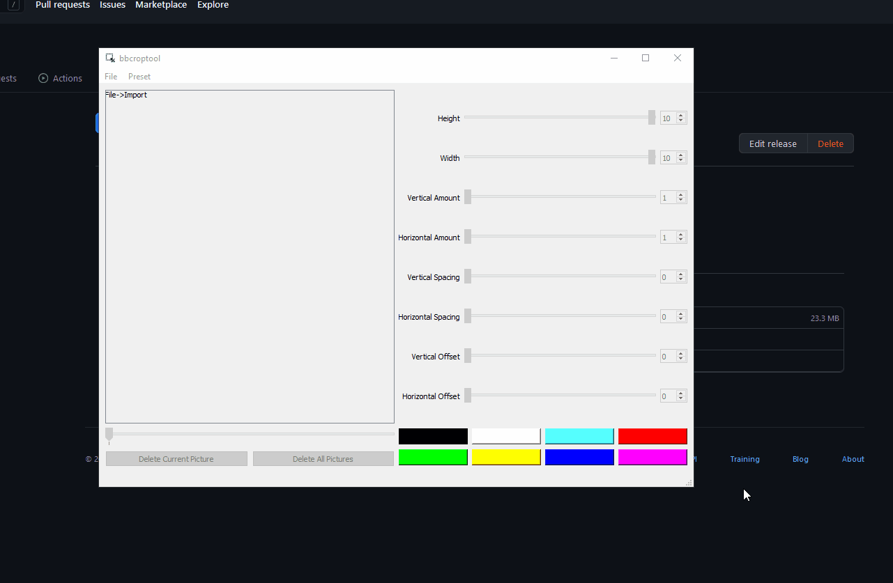

### What is this?
A simple utility for cropping multiple images into multiple smaller images
### Who was this built for?
This was primarily built as a tool to make cropping multiple pages of storyboards easier for use in animatics
### What else can this be used for?
Me and my friends have been using this to split up large amounts documents that need quick cropping
### Where can i try it?
You can try a precompiled version under [Releases](https://github.com/bmollusk/croptool/releases/)
### What does it look like right now?

### What big features does it have?
1. Can save cropping layouts, so you don't always have to set up the sliders each time
2. Adaptive sliders that change to whatever image you import
